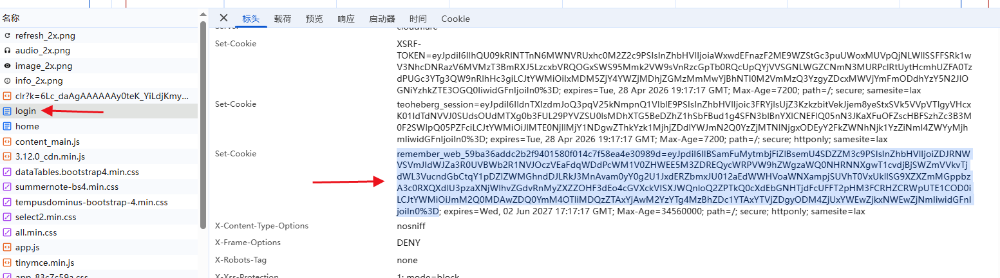

# 🚀 TeoHeberg 广告任务自动化

# 动动小手点点 Star ⭐

基于 **Cloudflare Workers** 部署的 **TeoHeberg 每日广告任务**自动化脚本，支持 Cookie 自动续期、积分追踪与 Telegram 通知。

---

## 📌 功能说明

* ✅ 自动完成每日广告任务
* ✅ 多账号管理，支持批量导入
* ✅ Cookie 自动被动更新
* ✅ 积分提取，Telgram 通知展示积分变化
* ✅ 支持手动触发（网页管理面板 / API）
* ✅ 支持定时 Cron 触发
* ✅ 前端界面支持账号增删、Cookie 手动更新、单账号执行
* ✅ 完整 API 接口，可集成到其他自动化流程

---

## ⚠️ 注意事项

> ❗ 依赖已登录的 Cookie，**不提供自动登录功能**，首次需手动获取
> 
> ❗ 请确保 Cookie 包含 `XSRF-TOKEN` 和 `teoheberg_session`

---

## 📝 注册地址

👉 [https://manager.teoheberg.fr/](https://manager.teoheberg.fr/)

---

## 🚀 部署方式

1. 登录 [Cloudflare Dashboard](https://dash.cloudflare.com/)，进入 Workers 页面
2. 创建一个新的 Worker，将本项目 [worker.js](./worker.js) 代码粘贴进去
3. 创建 **KV 命名空间**，名称随意，绑定到 Worker，绑定变量名为 `TEOHEBERG_KV`
4. 配置环境变量（见下表）
5. 部署 Worker

---

## 🔧 环境变量配置

| 变量名 | 说明 | 是否必须 |
|--------|------|----------|
| `AUTH_KEY` | 访问密钥，保护 API 和管理面板 | ✅ 是 |
| `TELEGRAM_BOT_TOKEN` | Telegram Bot Token | 否（不填则不通知） |
| `TELEGRAM_CHAT_ID` | 接收通知的 Chat ID | 否 |

### ⚙️ KV 绑定
在 Worker 设置 → Variables → KV Namespace Bindings 中添加：

| 变量名 | KV 命名空间 |
|--------|------------|
| `TEOHEBERG_KV` | 你创建的 KV |

---

## 📄 账号添加格式

在管理面板的文本框中，按以下格式输入：

```
邮箱/备注-----Cookie1
邮箱/备注-----Cookie2
```

**示例：**
```
admin@gmail.com-----XSRF-TOKEN=eyJ...; teoheberg_session=eyJ...
备注-----XSRF-TOKEN=abc...; teoheberg_session=def...
```

### 🔍 如何获取 Cookie？
1. 浏览器登录 [manager.teoheberg.fr](https://manager.teoheberg.fr)
2. 打开开发者工具 (F12) → Network 标签
3. 刷新页面，点击任意请求
4. 在 **Request Headers** 中找到 `Cookie` 字段，复制完整值
5. 使用 `邮箱-----Cookie` 格式导入

### Cookie 格式 


---

## ⏰ 定时任务（Cron）

在 Worker 的 **Triggers** 中添加 Cron 触发器，例如：

```
0 0 * * *
```

> 表示每天 UTC 0:00（北京时间 8:00）自动执行一次所有账号的广告任务。

---

## 🌐 使用方式

### 1️⃣ 浏览器管理面板
直接访问 Worker 域名，输入 `AUTH_KEY` 即可进入管理界面：
```
https://你的域名/
```
功能包括：
- 📊 查看账号列表和统计
- ✏️ 批量添加账号
- 🗑️ 删除账号
- ▶️ 手动执行单个账号
- 🔄 手动执行所有账号
- 🍪 弹窗手动更新 Cookie

---

### 2️⃣ API 触发单个账号
```bash
curl "https://你的域名/run?email=admin@example.com&key=你的AUTH_KEY"
```

---

### 3️⃣ API 触发所有账号
```bash
curl "https://你的域名/run-all?key=你的AUTH_KEY"
```

---

### 4️⃣ 查看账号列表
```bash
curl "https://你的域名/accounts?key=你的AUTH_KEY"
```

---

## 📸 效果展示

### 🔔 Telegram 通知效果
- 任务完成时：
  ```
  ✅ 广告任务已完成
  
  账号：admin@example.com
  积分：0,00 -> 6,00
  广告：执行 3 次
  
  TeoHeberg Daily Points
  ```
- 额度用完时：
  ```
  ⏳ 冷却中
  
  账号：admin@example.com
  积分：6,00
  广告：今日额度已用完
  
  TeoHeberg Daily Points
  ```
---

## 💬 Telegram 通知说明

配置 `TELEGRAM_BOT_TOKEN` 和 `TELEGRAM_CHAT_ID` 后：
- ✅ 每次任务执行完毕自动推送积分变化
- ✅ 额度已用完时提示冷却
- ❌ 遇到 Cookie 失效、网络错误等会推送错误信息

---

## ❤️ 支持项目

如果这个项目对你有帮助：

👉 点个 **Star ⭐** 支持一下吧！

---

**⚠️ 免责声明**：本脚本仅供学习交流使用，使用者需遵守 TeoHeberg 的服务条款。因使用本脚本造成的任何问题，作者不承担任何责任。
